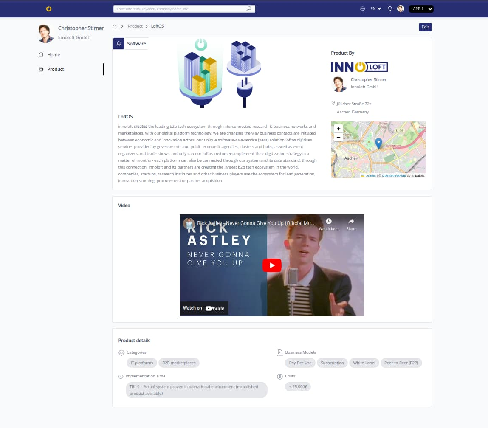
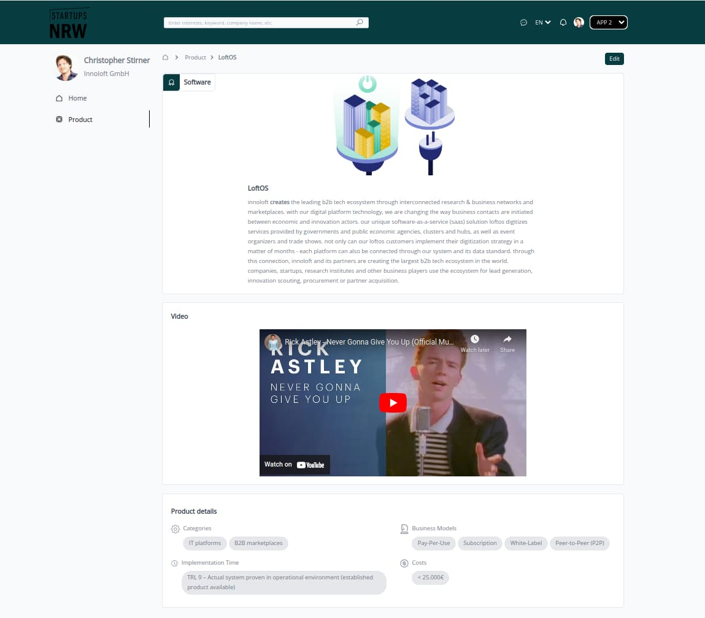

## Sample Product Dashboard

A sample dashboard that can display and edit product information.

## Features

1. **Home page (/)**

   - Displays only the company's logo.

2. **Product Page (/product)**

   - Displays the product information, video and description.

3. **Product Edit Page (/product/edit)**

   - Allows edit of product information, video and description

4. **White-Labeling**

   - This is done with APP configurations on the `.env` file.
   - You can switch APP config by selecting another `APP_ID` on the top right corner of the header.
   - If the APP config has `hasUserSection :false`, the user info is hidden.

## Screenshots

1. Dashboard showing product page of APP 1.
   

2. Dashboard showing product page of APP 2. You can select another APP using the select button on the top right corner of the header.
   

3. Dashboard showing product edit page.
   

## Setup

You would need to have [Node.js](https://nodejs.org/en/) and [yarn](https://yarnpkg.com/) installed.

First, clone the repository:

```bash
https://github.com/chidexebere/product-dashboard
```

To install dependencies, you can run:

```bash
yarn
```

## Running the project

To run the project locally, in the project directory, run:

```bash
yarn start
```

Runs the app in the development mode.<br />
Open [http://localhost:3000](http://localhost:3000) to view it in the browser.

## Testing

To run test locally, in the project directory, run:

```bash
yarn test
```

## Technologies used

- React and TypeScript: used to build the UI components
- Tailwind CSS: for styling
- Redux (Redux toolkit): for managing app state
- React Query: for managing server state
- React testing library, React hooks testing library, MSW : for testing
- Eslint for linting and Prettier for code formating
